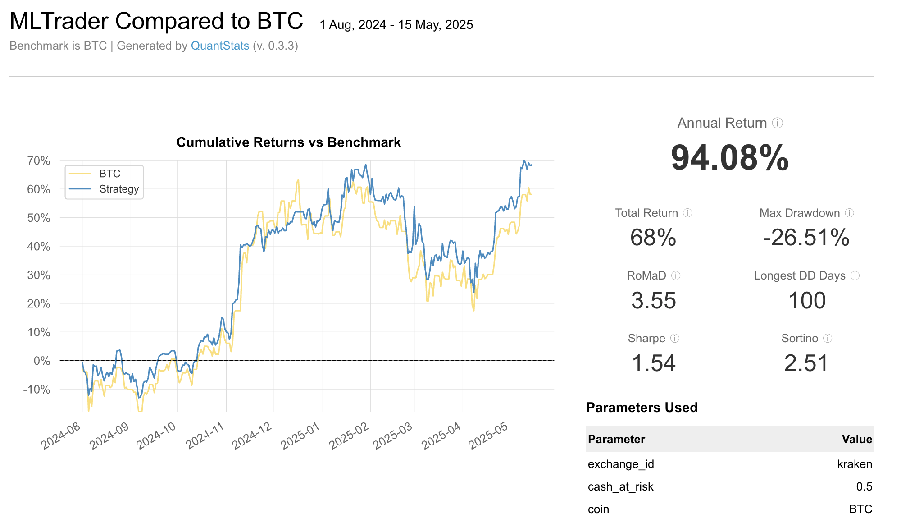
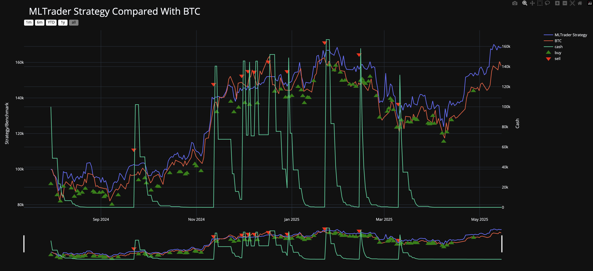
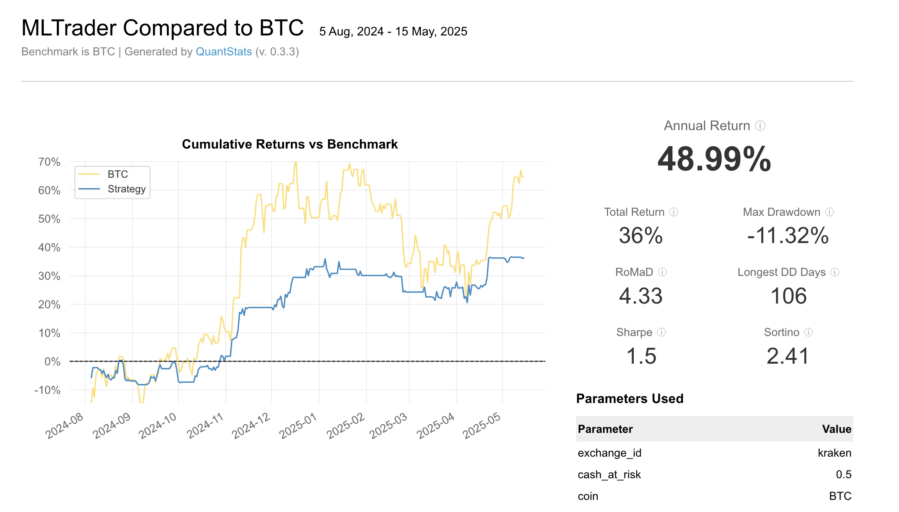
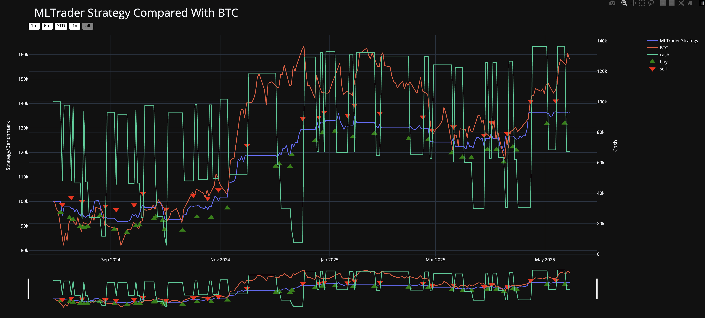

# CoinGhost

CoinGhost is an cryptocurrency trading bot that uses natural language models to analyze news data and make trading decisions for cryptocurrencies.

## Development Status

- **Version 1**: ✅ Complete - A functional trading bot using AI to analyze news for Bitcoin trading decisions
- **Version 2**: 🚧 In Progress - Expanding capabilities and improving performance

## Features

- Automated cryptocurrency trading strategy based on news sentiment analysis
- Fetches and analyzes latest news from Alpaca and Google News APIs
- Provides buy/sell/hold recommendations with confidence scores
- Backtesting capabilities using CCXT

## Requirements

- Python 3.11+
- LM Studio or Ollama or OpenAI
- MLX (Apple Silicon optimized ML library)
- OpenAI API key (optional)
- Alpaca API credentials (optional)
- LM Studio API credentials (optional)

## Installation

1. Clone the repository

```bash
git clone https://github.com/yourusername/CoinGhost.git
cd CoinGhost
```

2. Create a virtual environment

```bash
cd v1
python -m venv venv
source venv/bin/activate  # On Windows: venv\Scripts\activate
```

3. Install the required packages

```bash
pip install -r requirements.txt
```

4. Create a `.env` file in the project root with your API keys:

```
API_KEY=your_alpaca_api_key
API_SECRET=your_alpaca_api_secret
BASE_URL=https://paper-api.alpaca.markets/v2  # or your preferred Alpaca endpoint
OPENAI_API_KEY=your_openai_api_key
LMSTUDIO_API_KEY=your_lmstudio_api_key
LMSTUDIO_API_URL=your_lmstudio_api_url
LM_MODEL_NAME=your_lm_model_name
```

## Usage

### Running the Trading Bot

```python
python v1/trading.py
```

### Testing News Analysis

You can test the news analysis component independently:

```python
python v1/get_news.py
```

## Project Structure

### Version 1

- `v1/trading.py`: Contains the main MLTrader strategy class that implements the trading logic
- `v1/llm.py`: Interface to language models (GPT-4.1, Gemma, Mistral, ...) for news analysis
- `v1/get_news.py`: Functions for fetching and processing news from various sources

### Benchmarking

Testing models with 10 news articles:

Model: DeepSeek-R1-Distill-Llama-8B (Context length: 16384 tokens ~ 12,288 words)





Model: DeepSeek-R1-Distill-Qwen-7B (Context length: 16384 tokens ~ 12,288 words)






### Version 2 (Coming Soon)

## Configuration

You can adjust various parameters in the trading strategy:

- `cash_at_risk`: Percentage of cash to risk per trade (default: 0.5)
- `coin`: Target cryptocurrency (default: "BTC")
- Confidence threshold for trading (current: 0.7)
- `system_prompt`: System prompt for the LLM (default: see below)
```
You are a helpful financial assistant specialized in Bitcoin trading with the goal of maximizing profit. Your primary responsibility is to provide trading recommendations based on market analysis and current portfolio balance.

## Core Responsibilities:
- Analyze Bitcoin market trends and price movements
- Provide clear buy, sell, or hold recommendations
- Always check the BALANCE before making final decisions
- Follow the fundamental principles: BUY LOW, HOLD DURING UPTRENDS, SELL AT PEAKS

## Trading Rules:
1. ALWAYS verify the current BALANCE before recommending any action
2. You can recommend "buy" ONLY if cash > 0
3. You can recommend "sell" ONLY if Bitcoin > 0
4. If cash = 0 and you want to recommend buy, output "hold" with 1.0 confidence
5. If Bitcoin = 0 and you want to recommend sell, output "hold" with 1.0 confidence
6. If there is no news, you should "hold" with 1.0 confidence
7. Prioritize BUYING when prices are FALLING or at RELATIVE LOWS
8. Prioritize HOLDING when prices show STEADY UPWARD TRENDS to maximize gains
9. Prioritize SELLING only at RELATIVE PEAKS or signs of TREND REVERSAL
```
- `news_source`: News source to use for analysis (default: "alpaca")
- `flash attention`: Whether to use flash attention for the LLM (default: True)

## License

[MIT License](LICENSE)

## Acknowledgments

- Built with [Lumibot](https://github.com/Lumiwealth/lumibot) trading framework
- Uses [Alpaca Markets](https://alpaca.markets/) API for news data
- Leverages [MLX](https://github.com/ml-explore/mlx) for optimized machine learning on Apple Silicon
- Uses [LM Studio](https://lmstudio.ai/) for LLM inference
